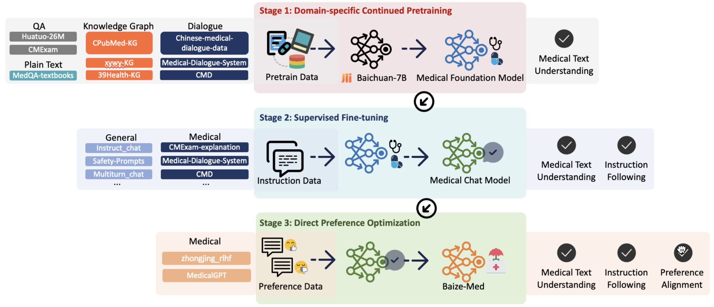

<div align="center">
  
</div>

-----------------

# Qilin-Med: Multi-stage Knowledge Injection Advanced Medical Large Language Model

> Qichen Ye, Junling Liu, Dading Chong, Peilin Zhou, Yining Hua, Andrew Liu, Xuxin Cheng

## 📖 Introduction
Integrating large language models (LLMs) into healthcare presents potential but faces challenges. Directly pre-training LLMs for domains like medicine is resource-heavy and sometimes unfeasible. Sole reliance on Supervised Fine-tuning (SFT) can result in overconfident predictions and may not tap into domainspecific insights. Addressing these challenges, we present a multi-stage training method combining Domain-specific Continued Pre-training (DCPT), SFT, and Direct Preference Optimization (DPO). A notable contribution of our study
is the introduction of a 3Gb Chinese Medicine (ChiMed) dataset, encompassing medical question answering, plain texts, knowledge graphs,
and dialogues, segmented into three training stages. The medical LLM trained with our pipeline, Qilin-Med, exhibits significant performance boosts.




## ✅ Todo

- [x] training scripts
- [ ] training data
- [ ] models
## 📚 Datasets
Our ChiMed dataset is avalibale at [here](https://huggingface.co/datasets/williamliu/ChiMed/tree/main), which containing the following three parts:
- ChiMed-Pretrain(`cpt.txt`), 
- ChiMed-SFT(`sft.jsonl`)
- ChiMed-DPO(`dpo.json`)

## Stage 1: Domain-specific Continued Pretraining
Put the CHiMed-Pretrain data (i.e., `cpt.txt`) at `data/pretrain/`, then run the following scripts.
```
bash run_pt.sh
```
## Stage 2: Supervised Fine-tuning
Put the CHiMed-SFT data (i.e., `sft.jsonl`) at `data/sft/`, then run the following scripts.
```
bash run_sft.sh
```
## Stage 3: Direct Preference Optimization
Put the CHiMed-DPO data (i.e., `dpo.json`) at `data/dpo/`, then using `scripts/merge_peft_adapter.py` to merge the sft adapter with `Qilin-Med-Pretrained`, then put the resulting model to `checkpoints/Qilin-Med-SFT-merged`. Finally run the following scripts.
```
bash run_dpo.sh
```
## Cite Us
```
@misc{ye2023qilinmed,
      title={Qilin-Med: Multi-stage Knowledge Injection Advanced Medical Large Language Model}, 
      author={Qichen Ye and Junling Liu and Dading Chong and Peilin Zhou and Yining Hua and Andrew Liu},
      year={2023},
      eprint={2310.09089},
      archivePrefix={arXiv},
      primaryClass={cs.CL}
}
```
## Acknowledgement

Many thanks to the following awesome works!

- [MedicalGPT](https://github.com/shibing624/MedicalGPT)
- [Transformers](https://github.com/huggingface/transformers)
- [ZhongJing](https://github.com/SupritYoung/Zhongjing)
- [BitsAndBytes](https://github.com/TimDettmers/bitsandbytes)
